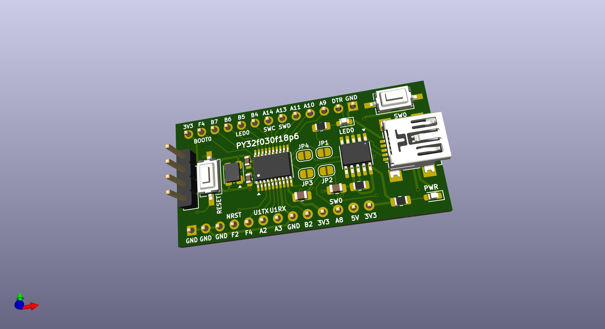
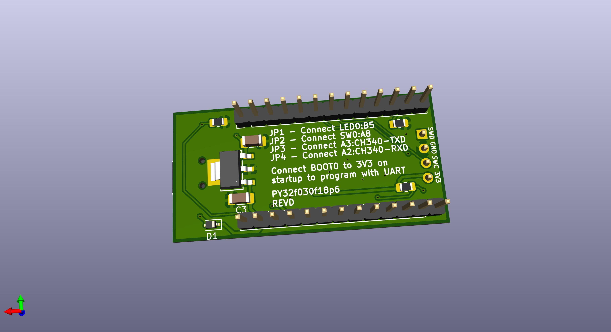
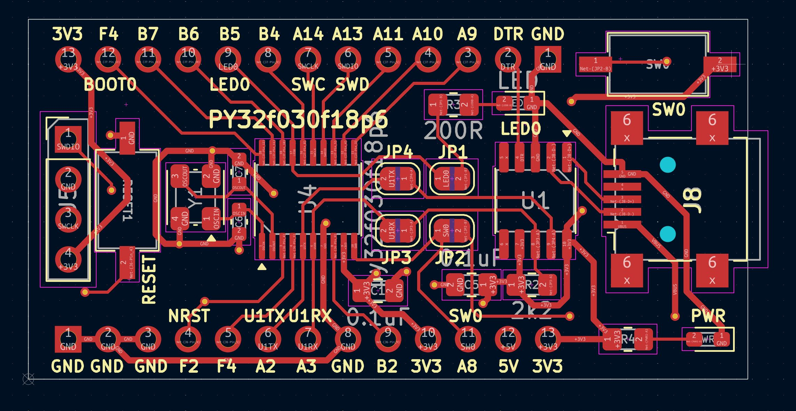
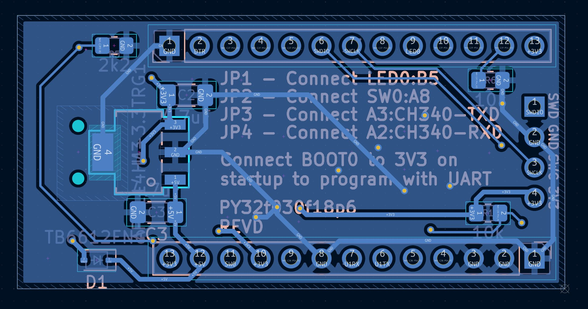

# py32f030f18p6
Simple breakout board for py32f030f18p6

- 3.3v LDO powered from 5V USB.
- UART connectivity to USB via ch340k optionally connected using jumpers.
- ARM SWD programming interface header.
- All other pins are broken out to headers.
- 1 LED optionally connected to pin PB5 using jumper.
- 1 Button optionally connected to pin PA8 using jumper.
- 1 Button connected to RESET pin, pulled high.
- Booloader selected by putting jumper across BOOT0 and 3v3 pins

<table>
  <tr>
    <td> </td>
    <td> </td>
  </tr>
  <tr>
    <td> </td>
    <td> </td>
  </tr>
</table>
