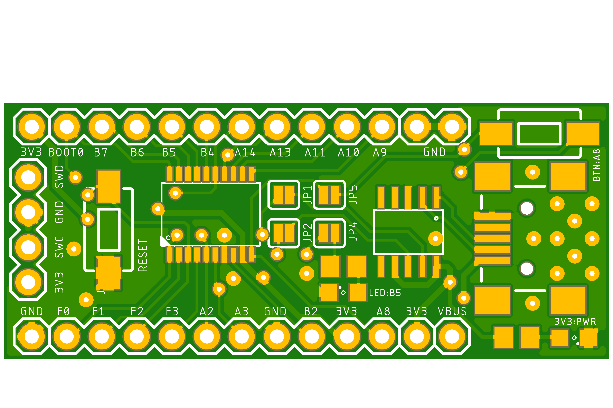
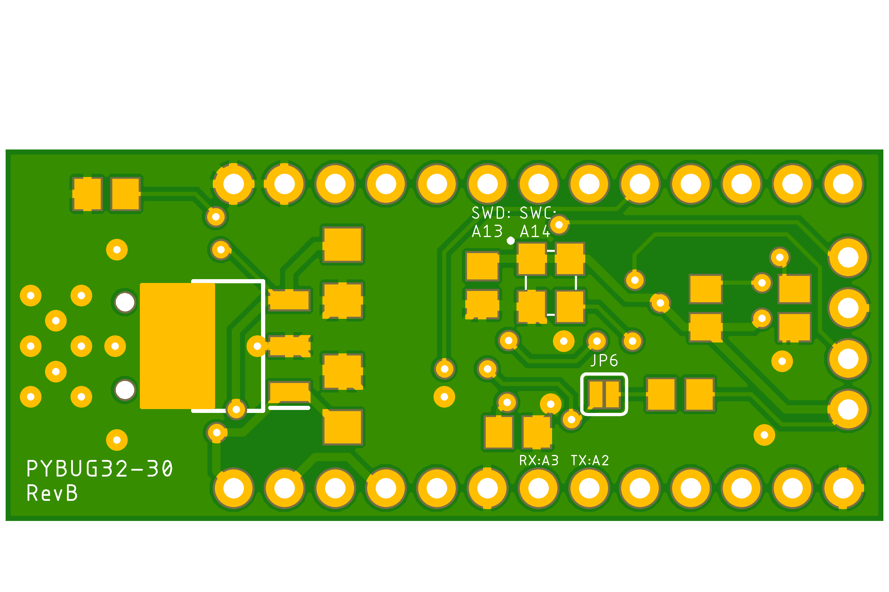

# py32f030f18p6
Simple breakout board for py32f030f18p6

- 3.3v LDO powered from 5V USB.
- UART connectivity to USB via ch340 optionally connected using jumpers.
- ARM SWD programming interface header.
- All other pins are broken out to headers.
- 1 LEDS optionally connected to pin PA1 using jumper.
- 1 Button optionally connected to pin PA0 using jumper.
- 1 Button connected to RESET pin, pulled high.
- 3 pin header used to select bootloader.

